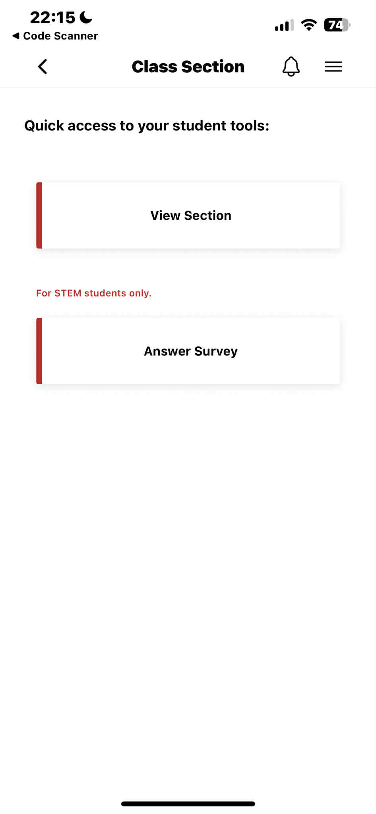
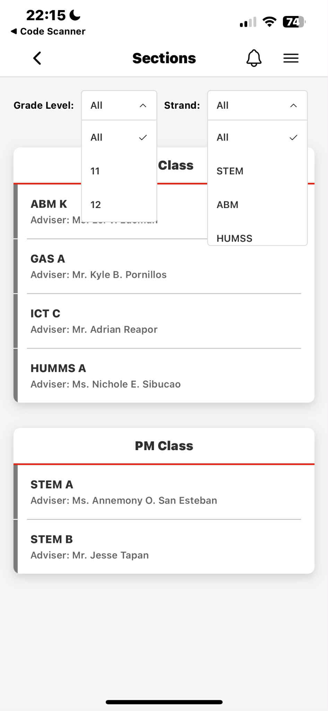
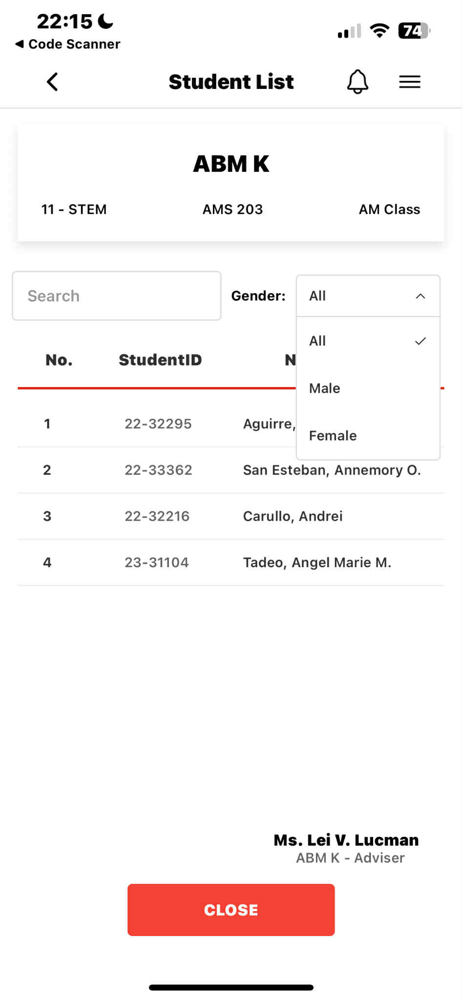
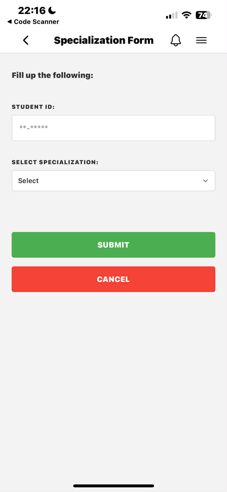

## Class Section View

This Class Section View Application is designed for both students and faculty members to easily access their academic sections.

## Screenshots

1. Student Tool Page:  
    

2. Class Sections Page:
    

3. Class/Students List Page:
    

4. Specialization Form:
    